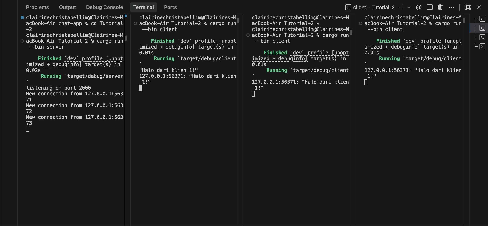
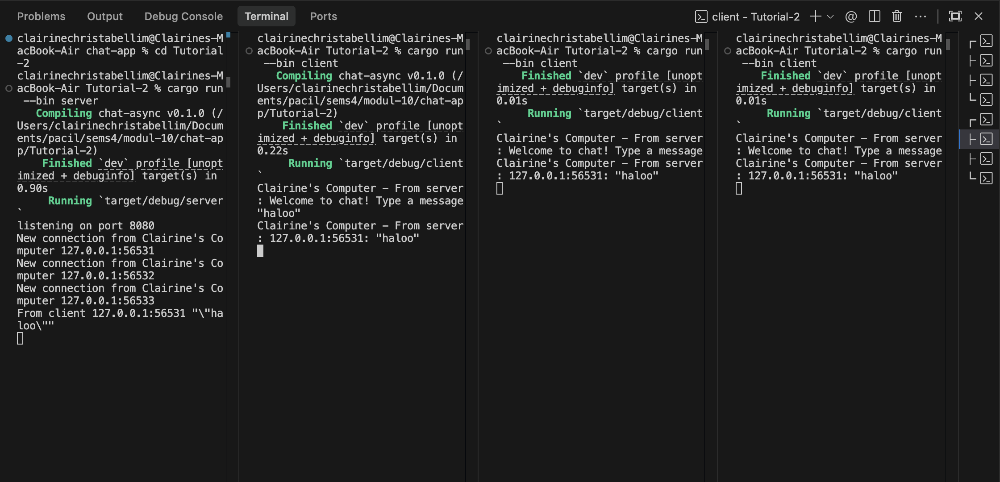

# Tutorial 2: Broadcast Chat

## Experiment 2.1: Original code, and how it run

### How to run
1. Start the server:
   ```bash
   cargo run --bin server
   ```
2. Open three different terminals and run the client in each:
   ```bash
   cargo run --bin client
   ```

### What happens
Ketika kita menjalankan `cargo run --bin server`, server akan mulai berjalan dan *listen* di *port* 2000. 
Kemudian saat kita menjalankan tiga `cargo run --bin client` di terminal yang berbeda, masing-masing *client* akan terhubung ke server tersebut via WebSocket.

Karena menggunakan `tokio::sync::broadcast`, server memiliki sebuah *broadcast channel*. Ketika salah satu *client* mengetik dan mengirimkan sebuah pesan:
1. *Client* mengirim pesan tersebut ke *server*.
2. *Server* menerima pesan, lalu menambahkan alamat IP & *port* pengirim di depan pesan (misal: `127.0.0.1:51234: halo semuanya`).
3. *Server* kemudian me-*broadcast* pesan tersebut ke saluran (*channel*) utama.
4. Semua *client* yang terhubung (termasuk *client* yang mengirim pesan tersebut) akan menerima pesan dari *server* dan menampilkannya secara instan di layar terminal mereka masing-masing.

Hal ini dapat terjadi secara konkuren (bersamaan) tanpa saling menunggu *input* karena kita menggunakan **asynchronous programming** dengan `tokio::select!` pada masing-masing *client* dan *server*.

### Screenshots

## Experiment 2.2: Modifying port
Untuk mengubah *port* koneksi *websocket*, kita harus mengubahnya di dua tempat karena komunikasi ini melibatkan **server** dan **client**:
1. Di `src/bin/server.rs`: Mengubah `TcpListener::bind("127.0.0.1:2000")` menjadi `TcpListener::bind("127.0.0.1:8080")` agar server mendengarkan (listen) koneksi masuk pada *port* 8080.
2. Di `src/bin/client.rs`: Mengubah URI `ws://127.0.0.1:2000` menjadi `ws://127.0.0.1:8080` agar klien tahu bahwa ia harus menghubungi *port* 8080.

Kedua belah pihak tetap menggunakan protokol *websocket* yang sama. Hal ini didefinisikan secara eksplisit oleh klien pada bagian URI dengan awalan `ws://` (`ws://127.0.0.1:8080`), yang menandakan bahwa koneksi tersebut akan dinegosiasikan (di-*upgrade* dari TCP/HTTP biasa) menjadi protokol WebSocket. Di sisi *server*, hal ini ditangani secara otomatis oleh *library* `tokio_websockets` ketika klien mengirimkan *request upgrade* tersebut.

## Experiment 2.3: Small changes, add IP and Port
Untuk mempermudah pelacakan pesan pada antarmuka *chat*, saya melakukan beberapa modifikasi format teks yang di-*print* ke terminal:
1. Di `src/bin/server.rs`: Menambahkan log ketika pesan diterima dari *client* dengan baris `println!("From client {addr:?} {text:?}");` sebelum *server* me-*broadcast* pesan tersebut. Saya juga memodifikasi log koneksi awal menjadi `"New connection from Clairine's Computer {addr:?}"`.
2. Di `src/bin/client.rs`: Menambahkan baris ucapan selamat datang saat pertama kali *client* terhubung dengan mengeksekusi `println!("Clairine's Computer - From server: Welcome to chat! Type a message");`. Kemudian, saat *client* menerima pesan dari server, saya menambahkan teks awalan sehingga menjadi `println!("Clairine's Computer - From server: {}", msg.as_text().unwrap());`.

Modifikasi ini bertujuan agar kita bisa memahami dengan jelas alur pengiriman pesan, sehingga terlihat bahwa setiap teks balasan yang muncul di klien benar-benar merupakan pesan yang telah dirutekan ulang (di-*relay*) oleh *server*.

### Screenshots

